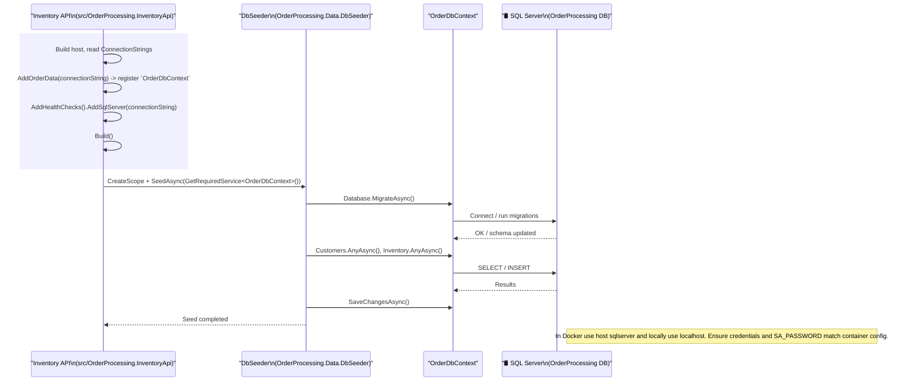
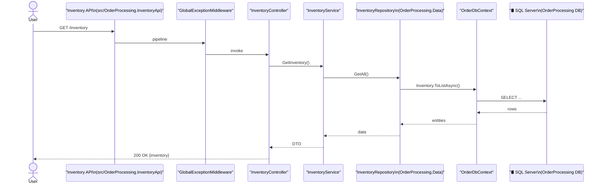
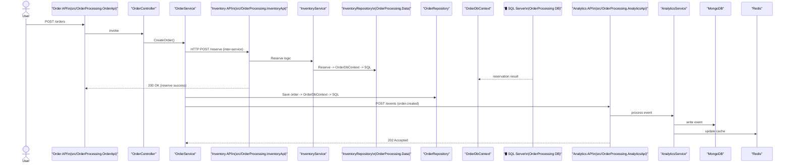

# UnoIthzellPerez

Real-time order processing platform — three .NET 8 APIs backed by SQL Server, MongoDB, and Redis.

**Solution:** `UnoIthzellPerez.sln`

```
Order API (5001) ──HTTP──> Inventory API (5002)
       │                          │
       │                          └── SQL Server
       ├── SQL Server
       └── HTTP ──> Analytics API (5003) ──> MongoDB + Redis
```

## Build

```bash
dotnet build UnoIthzellPerez.sln
```

## Run with Docker

```bash
docker-compose up --build
```

Swagger: `:5001/swagger`, `:5002/swagger`, `:5003/swagger`

## Local dev

```bash
docker-compose up sqlserver mongodb redis -d

dotnet run --project src/OrderProcessing.InventoryApi
dotnet run --project src/OrderProcessing.AnalyticsApi
dotnet run --project src/OrderProcessing.OrderApi
```

Migrations and seed data run automatically on startup.

## Main endpoints

| Method | Path | Notes |
|--------|------|-------|
| GET | `/api/orders/ping` | Health stub |
| GET | `/api/orders?status=Pending` | List/filter orders |
| GET | `/api/orders/{id}` | Order by id |
| POST | `/api/orders` | Creates order, reserves inventory, fires analytics event |
| PUT | `/api/orders/{id}/status` | Pending → Confirmed → Shipped → Delivered |
| GET | `/api/inventory/{productId}` | Stock levels |
| PUT | `/api/inventory/reserve` | Optimistic concurrency via ROWVERSION |
| GET | `/api/analytics/daily-sales?days=30` | Cached 5 min (Redis) |
| GET | `/api/analytics/top-products?limit=5` | Cached 5 min |

Discounts: 10% over $500, 20% over $1000.

Seed customers `CUST-001`–`CUST-005`. Products are seede by name; SQL Server assigns `ProductId` values starting at 1 in seed order.

## Tests

Requires Docker:

```bash
dotnet test UnoIthzellPerez.sln
```

## Layout

```
src/
  OrderProcessing.Core/           entities, events, repo interfaces
  OrderProcessing.Data/           EF Core, migrations, seed
  OrderProcessing.Services/       business logic, MediatR handlers
  OrderProcessing.OrderApi/       orders (port 5001)
  OrderProcessing.InventoryApi/   inventory (port 5002)
  OrderProcessing.AnalyticsApi/   analytics (port 5003)
tests/
  OrderProcessing.IntegrationTests/
  OrderProcessing.InventoryApi.Tests/
```

## Diagrams
### Application startup and database seeding
This diagram covers the initial setup, dependency registration, running migrations, and seeding the database with default customer and inventory data.


### Inventory query flow (`GET /inventory`)
This diagram maps out the standard read operation when a user requests the current stock data.


### Create order flow (`POST /orders`)
This diagram shows the complex write path, including inter-service HTTP communication to reserve stock, updating the SQL database, and broadcasting async events to MongoDB and Redis cache.

